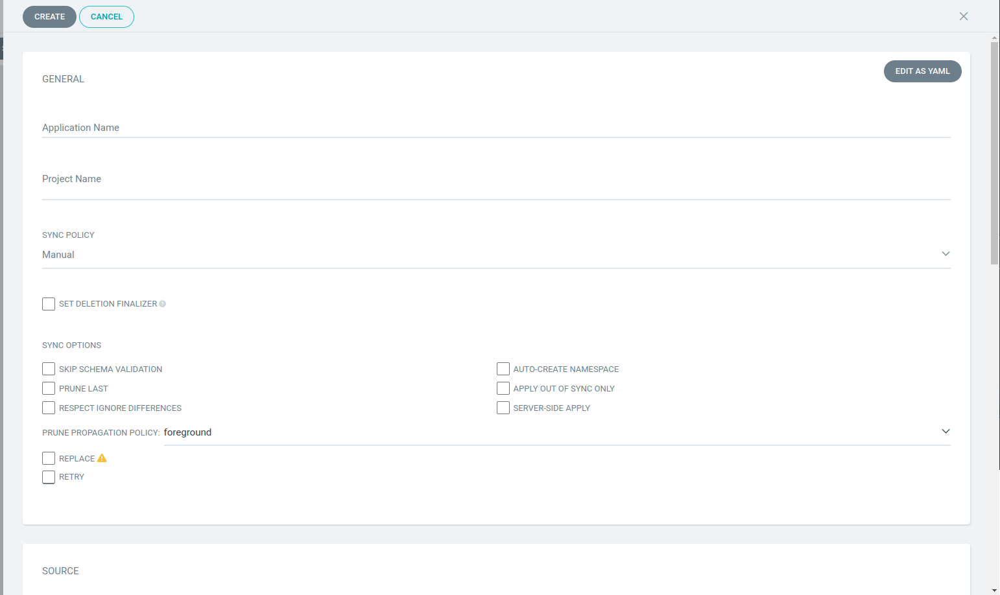

# Argo CD Essential Guide for End Users with Practice

## 01. Introduction

GitOps é uma estrutura operacional que aplica as melhores práticas de DevOps, tais como o armazenamento de infra estrutura como código de configuração para colocar suas árvores.
E ter em funcionamento um mecanismo de mudança. Como por exemplo, o uso de PR para rever o código antes mesclar na branch main.
E aplica as melhores práticas de CI/CD. Para validar, testar antes de implantar as aplicações e criar os recursos.
Antes do GitOps o administrador criava os recursos manualmente usando CLI ou o console. E desta forma não podemos reproduzir a mesma infra-estrutura novamente ou criar os mesmos ambientes com a mesma configuração.

Por que um GitOps?

- Versionamento do IaC
- Colaboração via Code Review
- CI: Validação e Testes automatizados
- CD: Implantações automatizados
- Segurança Melhorada
- Rollback
- GitOps Push vs GitOps Pull

> É UMA MÁ PRÁTICA TER UM IAC VERSIONADO NO SCM MAS APLICAR MANUALMENTE ELE SEM UTILIZAR UM CI/CD

## 02. Core Concepts

O que é ArgoCD?
ArgoCD é uma ferramenta de CD de GitOps para Kubernetes.
Portanto, ele tem o controlador que rastreia seus manifestos em um repositório, e mantem em sincronia com o seu cluster de destino.

ArgoCD vs Ferramenta Tradicional de CD?

- Ferramenta Tradicional de CD utiliza "Push Model" (GitLab CI, Azure Pipelinesm GitHub Actions)

  - build/unit tests --> build docker image --> publish into registry --> update k8s image tag --> kubectl apply -f deploy.yaml
  - Quando estamos utilizando essas ferramentas tradicionais de CD precisamos instalar o kubectl e o helm;
  - Quando estamos utilizando essas ferramentas tradicionais de CD precisamos conceder permissão para instalação dos recursos;
  - Quando estamos utilizando essas ferramentas tradicionais de CD precisamos ter conectividade com os cluster de destino;

- ArgoCD
  - Ferramenta de CI faz todo processo de: build/unit tests --> build docker image --> publish into registry --> update k8s image tag
  - ArgoCD Pull repositório com os manifestos (YAML, HELM, JSON, Kustomize) e faz a reconcialização.
  - Visibilidade do estado
    - estado da última sincronização
    - estado da saúde
    - estado atual
    - atualização em tempo real
  - Git como fonte da verdade.
  - Time de desenvolvimento e DevOps irá atualizar o código somente no Git.
  - Manter o seu cluster sincronizado com oGit.
  - Fácil rollback.
  - Mais seguro: Conceda acesso ao ArgoCD somente.
  - Solução de Disaster recovery: Você pode facilmente implantar a mesma aplicação em qualquer cluster k8s.

Application:

- Definição da origem e Destino para implantar um grupo de recursos k8s
  - origem: k8s manifests
  - destino: cluster e namespace

origem de aplicação:

- helm charts
- kustomize application
- directory of yaml files
- jsonnet

- Project

  - Projeto fornece um agrupamento lógico de aplicações.
    - Util quando o ArgoCD é utilizado por vários times.
    - Permitir apenas fontes específicas “repositórios git confiáveis”.
    - Permitir que aplicativos sejam implantados em clusters específicos e namespaces.
    - Permitir que recursos específicos sejam implantados “implantações, Statefulsets .. etc”.

- Estado desejado vs estado atual

  - Estado desejado: descrito no git
  - Estado atual: o que esta rodando atualmente

- Sincronismo

  - É o processo de tornar o estado desejado igual ao atual.

- Atualizar (Comparar)
  - Compara o código mais recente no Git com o estado ao vivo. Descubra o que é diferente.
  - O ArgoCD atualiza automaticamente a cada 3 minutos.

### Arquitetura do ArgoCD

- ArgoCD consiste em 3 principais componentes:
  1. ArgoCD Server (API + Web Server)
  2. ArgoCD Repo Server.
  3. ArgoCD Application Controller

#### 1. ArgoCD Server (API + Web Server)

Isto é um servidor em gRPC/REST cujo expõe uma API para ser consumida pela interface web e também pela linha de comando.
• Application management (Create, Update, Delete).
• Application operations (ex: Sync, Rollback)
• Repos and clusters management.
• Authentication.

#### 2. ArgoCD Repo Server.

Isto é um serviço interno que é responsável por clonar um repositório remoto git e gerar todos os manifestos necessários para o k8s.
• Clone git repo.
• Generate k8s manifests.

#### 3. ArgoCD Application Controller

É um controlador Kubernetes que monitora continuamente os aplicativos em execução e compara o estado atual e ativo com o estado de destino desejado.

- Comunica-se com o servidor Repo para obter os manifestos gerados.
- Comunica-se com a API k8s para obter o estado real do cluster.
- Implanta manifestos de aplicativos em clusters de destino.
- Detecta aplicativos fora de sincronia e toma ações corretivas "se necessário".
- Invoca ganchos definidos pelo usuário para eventos de ciclo de vida (PreSync, Sync, PostSync).

#### Componentes adicionais

- Redis: usado para cache.
- Dex: serviço de identidade para integrar com provedores de identidade externos.
- ApplicationSet Controller: automatiza a geração de aplicativos ArgoCD.

## 03. Setting-Up ArgoCD

- Prerequisites

  - kubernetes cluster

- Opção de instalação

  - Sem alta disponibilidade (ambiente de desenvolvimento ou teste)
  - Com alta disponibilidade (Recomendado para produção / você precisa de no minimo de 3 worker nodes)
  - Light installation "Core" (Não é instalado UI e API Server, então não é preparado para end-users, somente para admins. Por default é não como sem alta disponibilidade)

- Opção de privilégios

  - O ArgoCD fornece duas opções para privilégios no cluster:

  1. Privilégios de administrador do cluster: onde o ArgoCD tem o acesso de administrador do cluster para implantar no cluster em que é executado.
  2. Privilégios de nível de namespace: use este conjunto de manifesto se você não precisa do Argo CD para implantar aplicativos no mesmo cluster em que o Argo CD é executado

- Opções de manifestos

1. Yaml
2. Helm Chart
3. Kustomize

```
You need to create a namespace for argocd.
kubectl create ns argocd
and then choose one of the below options :
1. Non-HA:
a. cluster-admin privileges: https://raw.githubusercontent.com/argoproj/argo-cd/stable/manifests/install.yaml
b. namespace level privileges: https://github.com/argoproj/argo-cd/raw/stable/manifests/namespace-install.yaml
2. HA:
a. cluster-admin privileges: https://github.com/argoproj/argo-cd/raw/stable/manifests/ha/install.yaml
b. namespace level privileges: https://github.com/argoproj/argo-cd/raw/stable/manifests/ha/namespace-install.yaml
3. Light installation "Core"
https://github.com/argoproj/argo-cd/raw/stable/manifests/core-install.yaml
4. Helm chart: https://github.com/argoproj/argo-helm/tree/main/charts/argo-cd
```

```
Getting Initial Admin Password
kubectl get secrets -n argocd
kubectl get secrets argocd-initial-admin-secret -n argocd -o yaml
kubectl port-forward svc/argocd-server -n argocd 8080:443
```

- ArgoCD CLI
  - Você pode interagor com o ArgoCD através:
    - CLI
    - Web UI
    - REST/gRPC API
  - A CLI é muito útil quando você precisa interagir com o ArgoCD em uma pipeline de CI.
  - Comandos:
    - Gerenciar aplicações;
    - Gerenciar repositórios;
    - Gerenciar clusters;
    - Tarefas gerenciais;
    - Gerenciar projetos;
    - E mais...
  - [Instalação](https://argo-cd.readthedocs.io/en/stable/cli_installation/):

```
# Linux
brew install argocd
# or
yay -Sy argocd-bin
# or using curl
curl -sSL -o /usr/local/bin/argocd https://github.com/argoproj/argo-cd/releases/latest/download/argocd-linux-amd64

# Mac
brew install argocd
# or using curl
VERSION=$(curl --silent "https://api.github.com/repos/argoproj/argo-cd/releases/latest" | grep '"tag_name"' | sed -E 's/.*"([^"]+)".*/\1/’)
curl -sSL -o /usr/local/bin/argocd https://github.com/argoproj/argo-cd/releases/download/$VERSION/argocd-darwin-amd64

# Windows
$version = (Invoke-RestMethod https://api.github.com/repos/argoproj/argo-cd/releases/latest).tag_name
$url = "https://github.com/argoproj/argo-cd/releases/download/" + $version + "/argocd-windows-amd64.exe"
Invoke-WebRequest -Uri $url -OutFile $output
```

- Login:

```
argocd login localhost:8080
argocd cluster list
```

## 04. Applications

Aplicativo ArgoCD

- Aplicativo é um objeto de recurso do Kubernetes que representa uma instância de aplicativo implantada em um ambiente.
- Ele é definido por duas informações principais:
  - Origem: referência ao estado desejado no Git (repositório, revisão, caminho)
  - Destino: referência ao cluster de destino e namespace

Os aplicativos podem ser criados usando as opções abaixo:

- Declarativamente “Yaml”. (Recomendado)
- Interface de usuário da Web
- CLI

### Declarativamente

```
apiVersion: argoproj.io/v1alpha1
kind: Application
metadata:
  name: portfolio
  namespace: argocd
spec:
  destination:
    namespace: portfolio
    server: "https://kubernetes.default.svc"
  project: default
  source:
    path: portfolio
    repoURL: "https://github.com/kumabes-org/argocd-example-apps.git"
    targetRevision: main
  syncPolicy:
    syncOptions:
      - CreateNamespace=true
```

### Interface de usuário da Web



### CLI

```
argocd app create nodejs-webapp \
    --repo https://github.com/kumabes-org/argocd-example-apps.git \
    --path nodejs-webapp \
    --dest-server https://kubernetes.default.svc \
    --dest-namespace nodejs-webapp \
    --sync-option CreateNamespace=true
```

```
argocd app list
argocd app sync nodejs-webapp
argocd app sync portfolio

argocd app sync argocd/arc-systems
argocd app sync argocd/arc-runners
```

### Tools Detections

```Directory Of Yaml files
apiVersion: argoproj.io/v1alpha1
kind: Application
metadata:
  name: guestbook
  namespace: argocd
spec:
  destination:
    namespace: guestbook
    server: "https://kubernetes.default.svc"
  project: default
  source:
    path: guestbook
    repoURL: "https://github.com/argoproj/argocd-example-apps.git"
    targetRevision: HEAD
    directory:
      recurse: true
```

```Helm Charts
apiVersion: argoproj.io/v1alpha1
kind: Application
metadata:
  name: guestbook
  namespace: argocd
spec:
  destination:
    namespace: guestbook
    server: "https://kubernetes.default.svc"
  project: default
  source:
    path: guestbook
    repoURL: "https://github.com/argoproj/argocd-example-apps.git"
    targetRevision: HEAD
    helm:
      releaseName: guestbook
```

```Kustomize
apiVersion: argoproj.io/v1alpha1
kind: Application
metadata:
  name: guestbook
  namespace: argocd
spec:
  destination:
    namespace: guestbook
    server: "https://kubernetes.default.svc"
  project: default
  source:
    path: guestbook-kustomize
    repoURL: "https://github.com/argoproj/argocd-example-apps.git"
    targetRevision: HEAD
    kustomize:
      version: v3.5.4
```

```Not Set, Auto Detected
apiVersion: argoproj.io/v1alpha1
kind: Application
metadata:
  name: guestbook
  namespace: argocd
spec:
  destination:
    namespace: guestbook
    server: "https://kubernetes.default.svc"
  project: default
  source:
    path: guestbook
    repoURL: "https://github.com/argoproj/argocd-example-apps.git"
    targetRevision: HEAD
```

- Precedência:
  - Helm
  - Kustomize
  - Caso contrário, presume-se que seja um aplicativo de diretório Yaml simples.

### Helm Options

Os aplicativos Helm podem ser implantados de duas fontes

1. Repositório Git.
2. Repositório Helm.

```Repositório Git
apiVersion: argoproj.io/v1alpha1
kind: Application
metadata:
  name: guestbook
  namespace: argocd
spec:
  destination:
    namespace: guestbook
    server: "https://kubernetes.default.svc"
  project: default
  source:
    path: helm-guestbook
    repoURL: "https://github.com/argoproj/argocd-example-apps.git"
    targetRevision: HEAD
```

```Repositório Helm.
apiVersion: argoproj.io/v1alpha1
kind: Application
metadata:
  name: guestbook
  namespace: argocd
spec:
  destination:
    namespace: guestbook
    server: "https://kubernetes.default.svc"
  project: default
  source:
    chart: sealed-secret
    repoURL: "https://bitnami-labs.github.io/sealed-secrets"
    targetRevision: 1.16.1 # For Helm, this refers to the chart version
```

- Opções
  - ArgoCD fornece o seguinte para opções:
    - Nome da versão.
    - Arquivos de valores.
    - Parâmetros.
    - Parâmetros de arquivo.
    - Valores como arquivo de bloco.

```Nome da versão
apiVersion: argoproj.io/v1alpha1
kind: Application
metadata:
  name: guestbook
  namespace: argocd
spec:
  destination:
    namespace: guestbook
    server: "https://kubernetes.default.svc"
  project: default
  source:
    path: helm-guestbook
    repoURL: "https://github.com/argoproj/argocd-example-apps.git"
    targetRevision: HEAD
    helm:
      releaseName: # override release name (defaults to application name)
```

```Arquivos de valores
apiVersion: argoproj.io/v1alpha1
kind: Application
metadata:
  name: guestbook
  namespace: argocd
spec:
  destination:
    namespace: guestbook
    server: "https://kubernetes.default.svc"
  project: default
  source:
    path: helm-guestbook
    repoURL: "https://github.com/argoproj/argocd-example-apps.git"
    targetRevision: HEAD
    helm:
      valuesFiles: # can set multi values files, (defaults to values.yaml in source repo)
      - values-prod.yaml
```

```Parâmetros
apiVersion: argoproj.io/v1alpha1
kind: Application
metadata:
  name: guestbook
  namespace: argocd
spec:
  destination:
    namespace: guestbook
    server: "https://kubernetes.default.svc"
  project: default
  source:
    path: helm-guestbook
    repoURL: "https://github.com/argoproj/argocd-example-apps.git"
    targetRevision: HEAD
    helm:
      parameters: # override any values in a values.yaml
      - name: “service.type”
        value: “LoadBalancer”
      - name: “image.tag”
        value: “v2”
```

```Parâmetros de arquivo
apiVersion: argoproj.io/v1alpha1
kind: Application
metadata:
  name: guestbook
  namespace: argocd
spec:
  destination:
    namespace: guestbook
    server: "https://kubernetes.default.svc"
  project: default
  source:
    path: helm-guestbook
    repoURL: "https://github.com/argoproj/argocd-example-apps.git"
    targetRevision: HEAD
    helm:
      fileParameters: # set parameter values from a file
      - name: config
        value: files/config.json
```

```Valores como arquivo de bloco.
apiVersion: argoproj.io/v1alpha1
kind: Application
metadata:
  name: guestbook
  namespace: argocd
spec:
  destination:
    namespace: guestbook
    server: "https://kubernetes.default.svc"
  project: default
  source:
    path: helm-guestbook
    repoURL: "https://github.com/argoproj/argocd-example-apps.git"
    targetRevision: HEAD
    helm:
      values: |
        ingress:
          enabled: true
          path: /
          hosts:
          - mydomain.example.com
```

```
argocd app list
argocd app delete portfolio --cascade
argocd app delete nodejs-webapp --cascade
argocd app delete python-webapp --cascade

argocd app delete argocd/arc-runners --cascade
argocd app delete argocd/arc-systems --cascade

```

### Diretório de arquivos Opções

#### Diretório - Opções

- ArgoCD fornece o abaixo como opções
  - Recursivo: inclui todos os arquivos em subdiretórios.
  - Jsonnet
    - Vars externas: lista de variáveis ​​externas para Jsonnet.
    - Argumentos de nível superior.

```Diretório Recursivo
apiVersion: argoproj.io/v1alpha1
kind: Application
metadata:
  name: guestbook
  namespace: argocd
spec:
  destination:
    namespace: guestbook
    server: "https://kubernetes.default.svc"
  project: default
  source:
    path: guestbook-with-sub-directories
    repoURL: "https://github.com/argoproj/argocd-example-apps.git"
    targetRevision: master
    directory:
      recurse: true # include all sub-driectories
```

```Diretório Jsonnet Vars externas
apiVersion: argoproj.io/v1alpha1
kind: Application
metadata:
  name: guestbook
  namespace: argocd
spec:
  destination:
    namespace: guestbook
    server: "https://kubernetes.default.svc"
  project: default
  source:
    path: guestbook-with-sub-directories
    repoURL: "https://github.com/argoproj/argocd-example-apps.git"
    targetRevision: master
    directory:
      jsonnet:
        extVars:
        - name: service
          value: “internal”
```

```Diretório Jsonnet Argumentos de nível superior
apiVersion: argoproj.io/v1alpha1
kind: Application
metadata:
  name: guestbook
  namespace: argocd
spec:
  destination:
    namespace: guestbook
    server: "https://kubernetes.default.svc"
  project: default
  source:
    path: guestbook-with-sub-directories
    repoURL: "https://github.com/argoproj/argocd-example-apps.git"
    targetRevision: master
    directory:
      jsonnet:
        tlas:
        - name: service
          value: “internal”
          code: false
```

### Kustomize Options

#### Opções

- O ArgoCD fornece o seguinte para opções:
  - Prefixo de nome: anexado a recursos.
  - Sufixo de nome: anexado a recursos.
  - Imagens: para substituir imagens.
  - Rótulos comuns: defina rótulos em todos os recursos.
  - Anotações comuns: defina anotações em todos os recursos.
  - Versão: defina explicitamente a versão do kustomize.

```Prefixo de nome
apiVersion: argoproj.io/v1alpha1
kind: Application
metadata:
  name: kustomize-guestbook
  namespace: argocd
spec:
  destination:
    namespace: guestbook
    server: "https://kubernetes.default.svc"
  project: default
  source:
    path: kustomize-guestbook
    repoURL: "https://github.com/argoproj/argocd-example-apps.git"
    targetRevision: HEAD
    kustomize:
      namePrefix: staging- # adds a prefix to all resources names
```

```Sufixo de nome
apiVersion: argoproj.io/v1alpha1
kind: Application
metadata:
  name: kustomize-guestbook
  namespace: argocd
spec:
  destination:
    namespace: guestbook
    server: "https://kubernetes.default.svc"
  project: default
  source:
    path: kustomize-guestbook
    repoURL: "https://github.com/argoproj/argocd-example-apps.git"
    targetRevision: HEAD
    kustomize:
      nameSuffix: -staging # adds a suffix to all resources names
```

```Imagens
apiVersion: argoproj.io/v1alpha1
kind: Application
metadata:
  name: kustomize-guestbook
  namespace: argocd
spec:
  destination:
    namespace: guestbook
    server: "https://kubernetes.default.svc"
  project: default
  source:
    path: kustomize-guestbook
    repoURL: "https://github.com/argoproj/argocd-example-apps.git"
    targetRevision: HEAD
    kustomize:
      images:
        - gcr.io/heptio-images/ks-guestbook-demo:0.2
```

```Rótulos comuns
apiVersion: argoproj.io/v1alpha1
kind: Application
metadata:
  name: kustomize-guestbook
  namespace: argocd
spec:
  destination:
    namespace: guestbook
    server: "https://kubernetes.default.svc"
  project: default
  source:
    path: kustomize-guestbook
    repoURL: "https://github.com/argoproj/argocd-example-apps.git"
    targetRevision: HEAD
    kustomize:
      commonLabels:
        app: demo
        appVersion: 1.0
```

```Anotações comuns
apiVersion: argoproj.io/v1alpha1
kind: Application
metadata:
  name: kustomize-guestbook
  namespace: argocd
spec:
  destination:
    namespace: guestbook
    server: "https://kubernetes.default.svc"
  project: default
  source:
    path: kustomize-guestbook
    repoURL: "https://github.com/argoproj/argocd-example-apps.git"
    targetRevision: HEAD
    kustomize:
      commonAnnotations:
        app: demo
        appVersion: 1.0
```

```Versão
apiVersion: argoproj.io/v1alpha1
kind: Application
metadata:
  name: kustomize-guestbook
  namespace: argocd
spec:
  destination:
    namespace: guestbook
    server: "https://kubernetes.default.svc"
  project: default
  source:
    path: kustomize-guestbook
    repoURL: "https://github.com/argoproj/argocd-example-apps.git"
    targetRevision: HEAD
    kustomize:
      version: v3.5.4
```

### Várias fontes para um aplicativo (ArgoCD >=2.6)

```
  sources:
    - chart: ingress-nginx
      repoURL: "https://charts.bitnami.com/ingress-nginx"
      targetRevision: 4.6.1
    - chart: prometheus-redis-exporter
      repoURL: "https://prometheus-community.github.io/helm-charts"
      targetRevision: 5.3.2
```

```
  sources:
    - chart: ingress-nginx
      repoURL: "https://charts.bitnami.com/ingress-nginx"
      targetRevision: 4.6.1
      helm:
        valuesFiles:
          - $values/ingress-nginx/values.yaml
    - repoURL: "https://github.com/kumabes-org/GitOps-example.git"
      ref: values
      targetRevision: master
```

> NOTAS: Ao utilizar várias fontes para um aplicativo você deve utilizar o campo "sources". Quando você utilizar o campo "sources", o ArgoCD irá ignorar o "source" campo no singular.

## 05. Projects

Por que Projetos?

- Projetos fornecem um agrupamento lógico de aplicativos.
- Projetos fornecem restrições de Acesso
  - Útil quando o ArgoCD é usado por várias equipes
    - Permitir apenas fontes específicas “repositórios git confiáveis”.
    - Permitir que aplicativos sejam implantados em clusters e namespaces específicos.
    - Permitir que recursos específicos sejam implantados “Implantações, Statefulsets .. etc”.
- Projetos fornecem recurso de Funções do Projeto
  - Permite que você crie uma função com um conjunto de políticas “permissões” para conceder acesso aos aplicativos de um projeto.
    - Você pode usá-lo para conceder ao sistema CI um acesso específico aos aplicativos do projeto.
      - Ele deve ser associado ao JWT.
    - Você pode usá-lo para conceder aos grupos oidc um acesso específico aos aplicativos do projeto.
- Projeto Padrão
  - O ArgoCD cria um projeto padrão assim que você o instala.

### Opções de criação de projeto

- Declarativa

```
apiVersion: argoproj.io/v1alpha1
kind: AppProject
metadata:
  name: project-1
  namespace: argocd
spec:
  description: project description
  sourceRepos:
    - “*”
  destinations:
    - server: “*”
      namespace: “*“
  clusterResourceWhitelist:
    - group: “*”
      kind: “*“
  namespaceResourceWhitelist:
    - group: “*”
      kind: “*"

```

- CLI

```

```

- Web UI
  

```Destino especifico
apiVersion: argoproj.io/v1alpha1
kind: AppProject
metadata:
  name: project-1
  namespace: argocd
spec:
  description: project description
  sourceRepos:
    - “*”
  destinations: # Only permit applications to deploy to the ns-1 namespace in the same cluster
    - server: https://kubernetes.default.svc
      namespace: “ns-1“
  clusterResourceWhitelist:
    - group: “*”
      kind: “*“
  namespaceResourceWhitelist:
    - group: “*”
      kind: “*"
```

```Repositório de Fonte Específica
apiVersion: argoproj.io/v1alpha1
kind: AppProject
metadata:
  name: project-1
  namespace: argocd
spec:
  description: project description
  sourceRepos: # Only permit this Git repos
    - “https://github.com/mabusaa/argocd-example-apps.git”
  destinations:
    - server: https://kubernetes.default.svc
      namespace: “ns-1“
  clusterResourceWhitelist:
    - group: “*”
      kind: “*“
  namespaceResourceWhitelist:
    - group: “*”
      kind: “*"
```

```Permitir recursos específicos do escopo do cluster
apiVersion: argoproj.io/v1alpha1
kind: AppProject
metadata:
  name: project-1
  namespace: argocd
spec:
  description: project description
  sourceRepos:
    - “*”
  destinations:
    - server: https://kubernetes.default.svc
      namespace: “ns-1“
  clusterResourceWhitelist: # Deny all cluster-scoped resources from being created, except for Namespace
    - group: “”
      kind: “Namespace“
  namespaceResourceWhitelist:
    - group: “*”
      kind: “*"
```

```Permitir recursos específicos com escopo de namespace
apiVersion: argoproj.io/v1alpha1
kind: AppProject
metadata:
  name: project-1
  namespace: argocd
spec:
  description: project description
  sourceRepos:
    - “*”
  destinations:
    - server: https://kubernetes.default.svc
      namespace: “ns-1“
  clusterResourceWhitelist:
    - group: “”
      kind: “Namespace“
  namespaceResourceWhitelist: # Deny all namespaced-scoped resources from being created, except for Deployment
    - group: “apps”
      kind: “Deployment"
```

```Lista negra de recursos específicos com escopo de namespace
apiVersion: argoproj.io/v1alpha1
kind: AppProject
metadata:
  name: project-1
  namespace: argocd
spec:
  description: project description
  sourceRepos:
    - “*”
  destinations:
    - server: https://kubernetes.default.svc
      namespace: “ns-1“
  clusterResourceWhitelist:
    - group: “”
      kind: “Namespace“
  namespaceResourceBlacklist: # Allow all namespaced-scoped resources to be created, except for NetworkPolicy
    - group: “”
      kind: “NetworkPolicy"
```

```Definir projeto no aplicativo
apiVersion: argoproj.io/v1alpha1
kind: Application
metadata:
  name: guestbook
  namespace: argocd
spec:
  destination:
    namespace: guestbook
    server: "https://kubernetes.default.svc"
  project: project-1
  source:
    path: helm-guestbook
    repoURL: "https://github.com/argoproj/argocd-example-apps.git"
    targetRevision: HEAD
```

### Recurso de Funções do Projeto

Permite que você crie uma função com um conjunto de políticas “permissões” para conceder acesso aos aplicativos de um projeto.

- Você pode usá-lo para conceder ao sistema CI um acesso específico aos aplicativos do projeto.
  - Ele deve ser associado ao JWT.
- Você pode usá-lo para conceder aos grupos oidc um acesso específico aos aplicativos do projeto.

```Função do projeto
apiVersion: argoproj.io/v1alpha1
kind: AppProject
metadata:
  name: project-1
  namespace: argocd
spec:
  description: project description
  sourceRepos:
    - “*”

  destinations:
    - server: “*”
      namespace: “*“

  clusterResourceWhitelist:
    - group: “*”
      kind: “*“

  roles:
    - name: ci-role
      description: Sync privileges for demo-project
      policies:
      - p,proj:demo-project:ci-role,applications,sync,demo-project/*,allow
```

### Criando um token

- As funções do projeto não são úteis sem gerar um JWT.
- Os tokens gerados não são armazenados no ArgoCD.
- Para criar um token usando CLI:

```
argocd proj role create-token PROJECT ROLE-NAME
```

### Usando o token na CLI

- Um usuário pode alavancar tokens na CLI passando-os usando o sinalizador "--auth-token" ou definindo a variável de ambiente "ARGOCD_AUTH_TOKEN".

```
argocd cluster list --auth-token <TOKEN_VALUE>
```

## 06. Repositories

50

## 07. Sync Policies and Options

## 08. Tracking Strategies

## 09. Diffing Customization

## 10. Sync Phases and Waves

## 11. Remote Kubernetes Clusters

## 12. ApplicationSet

## 13. Automation by CI Pipelines

## 14. Recommendations and Best Practices
